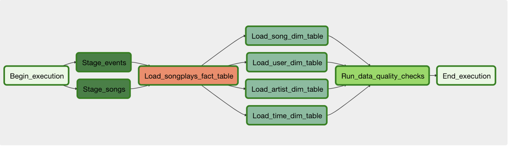

# Project 1: Data Modeling with Postgres
## Introduction
A startup called Sparkify wants to analyze the data they've been collecting on songs and user activity on their new music streaming app. The analytics team is particularly interested in understanding what songs users are listening to. Currently, they don't have an easy way to query their data, which resides in a directory of JSON logs on user activity on the app, as well as a directory with JSON metadata on the songs in their app.

They'd like a data engineer to create a Postgres database with tables designed to optimize queries on song play analysis, and bring you on the project. Your role is to create a database schema and ETL pipeline for this analysis. You'll be able to test your database and ETL pipeline by running queries given to you by the analytics team from Sparkify and compare your results with their expected results.

## Project Description
In this project, you'll apply what you've learned on data modeling with Postgres and build an ETL pipeline using Python. To complete the project, you will need to define fact and dimension tables for a star schema for a particular analytic focus, and write an ETL pipeline that transfers data from files in two local directories into these tables in Postgres using Python and SQL.

## Schema for Song Play Analysis
Using the song and log datasets, you'll need to create a star schema optimized for queries on song play analysis. This includes the following tables.

### Fact Table
**1. songplays** - records in log data associated with song plays i.e. records with page NextSong
songplay_id, start_time, user_id, level, song_id, artist_id, session_id, location, user_agent

### Dimension Tables
**1.users** - users in the app
user_id, first_name, last_name, gender, level
**2.songs** - songs in music database
song_id, title, artist_id, year, duration
**3.artists** - artists in music database
artist_id, name, location, latitude, longitude
**4.time** - timestamps of records in songplays broken down into specific units
start_time, hour, day, week, month, year, weekday

## Project Steps

### Create Tables
1. Write CREATE statements in sql_queries.py to create each table.
2. Write DROP statements in sql_queries.py to drop each table if it exists.
3. Run create_tables.py to create your database and tables.
4. Run test.ipynb to confirm the creation of your tables with the correct columns. Make sure to click "Restart kernel" to close the connection to the database after running this notebook.

### Build ETL Processes
Follow instructions in the etl.ipynb notebook to develop ETL processes for each table. At the end of each table section, or at the end of the notebook, run test.ipynb to confirm that records were successfully inserted into each table. Remember to rerun create_tables.py to reset your tables before each time you run this notebook.

### Build ETL Pipeline
Use what you've completed in etl.ipynb to complete etl.py, where you'll process the entire datasets. Remember to run create_tables.py before running etl.py to reset your tables. Run test.ipynb to confirm your records were successfully inserted into each table.

### Run Sanity Tests
When you are satisfied with your work, run the cell under the Sanity Tests section in the test.ipynb notebook. The cells contain some basic tests that will evaluate your work and catch any silly mistakes. We test column data types, primary key constraints and not-null constraints as well look for on-conflict clauses wherever required.

# Project 2: Data Modeling with Cassandra
## Introduction
A startup called Sparkify wants to analyze the data they've been collecting on songs and user activity on their new music streaming app. The analysis team is particularly interested in understanding what songs users are listening to. Currently, there is no easy way to query the data to generate the results, since the data reside in a directory of CSV files on user activity on the app.

They'd like a data engineer to create an Apache Cassandra database which can create queries on song play data to answer the questions, and wish to bring you on the project. Your role is to create a database for this analysis. You'll be able to test your database by running queries given to you by the analytics team from Sparkify to create the results.

## Project Overview
In this project, you'll apply what you've learned on data modeling with Apache Cassandra and complete an ETL pipeline using Python. To complete the project, you will need to model your data by creating tables in Apache Cassandra to run queries. You are provided with part of the ETL pipeline that transfers data from a set of CSV files within a directory to create a streamlined CSV file to model and insert data into Apache Cassandra tables.

We have provided you with a project template that takes care of all the imports and provides a structure for ETL pipeline you'd need to process this data.

# Project 3: Data Warehouse

## Introduction
A music streaming startup, Sparkify, has grown their user base and song database and want to move their processes and data onto the cloud. Their data resides in S3, in a directory of JSON logs on user activity on the app, as well as a directory with JSON metadata on the songs in their app.

As their data engineer, you are tasked with building an ETL pipeline that extracts their data from S3, stages them in Redshift, and transforms data into a set of dimensional tables for their analytics team to continue finding insights into what songs their users are listening to. You'll be able to test your database and ETL pipeline by running queries given to you by the analytics team from Sparkify and compare your results with their expected results.

## Project Description
In this project, you'll apply what you've learned on data warehouses and AWS to build an ETL pipeline for a database hosted on Redshift. To complete the project, you will need to load data from S3 to staging tables on Redshift and execute SQL statements that create the analytics tables from these staging tables.

## Schema for Song Play Analysis
Using the song and log datasets, you'll need to create a star schema optimized for queries on song play analysis. This includes the following tables.

### Fact Table
**1. songplays** - records in log data associated with song plays i.e. records with page NextSong
songplay_id, start_time, user_id, level, song_id, artist_id, session_id, location, user_agent

### Dimension Tables
**1.users** - users in the app
user_id, first_name, last_name, gender, level
**2.songs** - songs in music database
song_id, title, artist_id, year, duration
**3.artists** - artists in music database
artist_id, name, location, latitude, longitude
**4.time** - timestamps of records in songplays broken down into specific units
start_time, hour, day, week, month, year, weekday

## Project Steps
Below are steps you can follow to complete each component of this project.

### Create Table Schemas
1. Design schemas for your fact and dimension tables
2. Write a SQL CREATE statement for each of these tables in sql_queries.py
3. Complete the logic in create_tables.py to connect to the database and create these tables
4. Write SQL DROP statements to drop tables in the beginning of create_tables.py if the tables already exist. This way, you can run create_tables.py whenever you want to reset your database and test your ETL pipeline.
5. Launch a redshift cluster and create an IAM role that has read access to S3.
6. Add redshift database and IAM role info to dwh.cfg.
7. Test by running create_tables.py and checking the table schemas in your redshift database. You can use Query Editor in the AWS Redshift console for this.
### Build ETL Pipeline
1. Implement the logic in etl.py to load data from S3 to staging tables on Redshift.
2. Implement the logic in etl.py to load data from staging tables to analytics tables on Redshift.
3. Test by running etl.py after running create_tables.py and running the analytic queries on your Redshift database to compare your results with the expected results.
4. Delete your redshift cluster when finished.

# Project 4: Data Lake
## Introduction
A music streaming startup, Sparkify, has grown their user base and song database even more and want to move their data warehouse to a data lake. Their data resides in S3, in a directory of JSON logs on user activity on the app, as well as a directory with JSON metadata on the songs in their app.

As their data engineer, you are tasked with building an ETL pipeline that extracts their data from S3, processes them using Spark, and loads the data back into S3 as a set of dimensional tables. This will allow their analytics team to continue finding insights in what songs their users are listening to.

You'll be able to test your database and ETL pipeline by running queries given to you by the analytics team from Sparkify and compare your results with their expected results.

## Project Description
In this project, you'll apply what you've learned on Spark and data lakes to build an ETL pipeline for a data lake hosted on S3. To complete the project, you will need to load data from S3, process the data into analytics tables using Spark, and load them back into S3. You'll deploy this Spark process on a cluster using AWS.

# Project 5: Data Pipelines with Airflow
A music streaming company, Sparkify, has decided that it is time to introduce more automation and monitoring to their data warehouse ETL pipelines and come to the conclusion that the best tool to achieve this is Apache Airflow.

They have decided to bring you into the project and expect you to create high grade data pipelines that are dynamic and built from reusable tasks, can be monitored, and allow easy backfills. They have also noted that the data quality plays a big part when analyses are executed on top the data warehouse and want to run tests against their datasets after the ETL steps have been executed to catch any discrepancies in the datasets.

The source data resides in S3 and needs to be processed in Sparkify's data warehouse in Amazon Redshift. The source datasets consist of JSON logs that tell about user activity in the application and JSON metadata about the songs the users listen to.

## Project Overview
This project will introduce you to the core concepts of Apache Airflow. To complete the project, you will need to create your own custom operators to perform tasks such as staging the data, filling the data warehouse, and running checks on the data as the final step.

We have provided you with a project template that takes care of all the imports and provides four empty operators that need to be implemented into functional pieces of a data pipeline. The template also contains a set of tasks that need to be linked to achieve a coherent and sensible data flow within the pipeline.

You'll be provided with a helpers class that contains all the SQL transformations. Thus, you won't need to write the ETL yourselves, but you'll need to execute it with your custom operators.

# Data Engineering Capstone Project
## Overview
The purpose of the data engineering capstone project is to give you a chance to combine what you've learned throughout the program. This project will be an important part of your portfolio that will help you achieve your data engineering-related career goals.

In this project, you can choose to complete the project provided for you, or define the scope and data for a project of your own design. Either way, you'll be expected to go through the same steps outlined below.

## Udacity Provided Project
In the Udacity provided project, you'll work with four datasets to complete the project. The main dataset will include data on immigration to the United States, and supplementary datasets will include data on airport codes, U.S. city demographics, and temperature data. You're also welcome to enrich the project with additional data if you'd like to set your project apart.

## Open-Ended Project
If you decide to design your own project, you can find useful information in the Project Resources section. Rather than go through steps below with the data Udacity provides, you'll gather your own data, and go through the same process.

## Instructions
To help guide your project, we've broken it down into a series of steps.

### Step 1: Scope the Project and Gather Data
Since the scope of the project will be highly dependent on the data, these two things happen simultaneously. In this step, you’ll:

- Identify and gather the data you'll be using for your project (at least two sources and more than 1 million rows). See Project Resources for ideas of what data you can use.
- Explain what end use cases you'd like to prepare the data for (e.g., analytics table, app back-end, source-of-truth database, etc.)
### Step 2: Explore and Assess the Data
- Explore the data to identify data quality issues, like missing values, duplicate data, etc.
- Document steps necessary to clean the data
### Step 3: Define the Data Model
- Map out the conceptual data model and explain why you chose that model
- List the steps necessary to pipeline the data into the chosen data model
### Step 4: Run ETL to Model the Data
- Create the data pipelines and the data model
- Include a data dictionary
- Run data quality checks to ensure the pipeline ran as expected
- Integrity constraints on the relational database (e.g., unique key, data type, etc.)
- Unit tests for the scripts to ensure they are doing the right thing
- Source/count checks to ensure completeness
### Step 5: Complete Project Write Up
- What's the goal? What queries will you want to run? How would Spark or Airflow be incorporated? Why did you choose the model you chose?
- Clearly state the rationale for the choice of tools and technologies for the project.
- Document the steps of the process.
- Propose how often the data should be updated and why.
- Post your write-up and final data model in a GitHub repo.
- Include a description of how you would approach the problem differently under the following scenarios:
- If the data was increased by 100x.
- If the pipelines were run on a daily basis by 7am.
- If the database needed to be accessed by 100+ people.